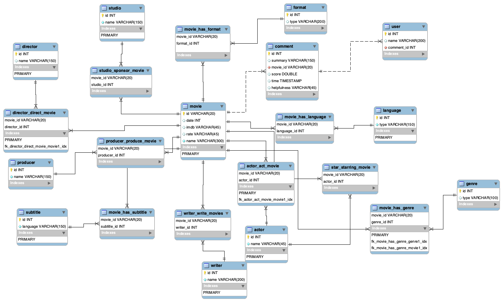
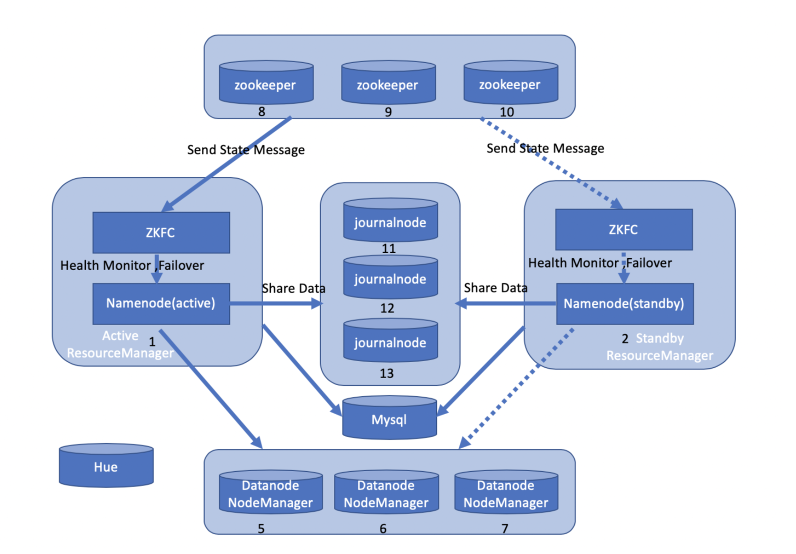
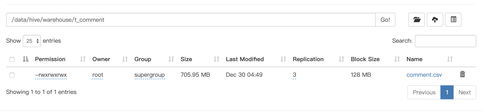
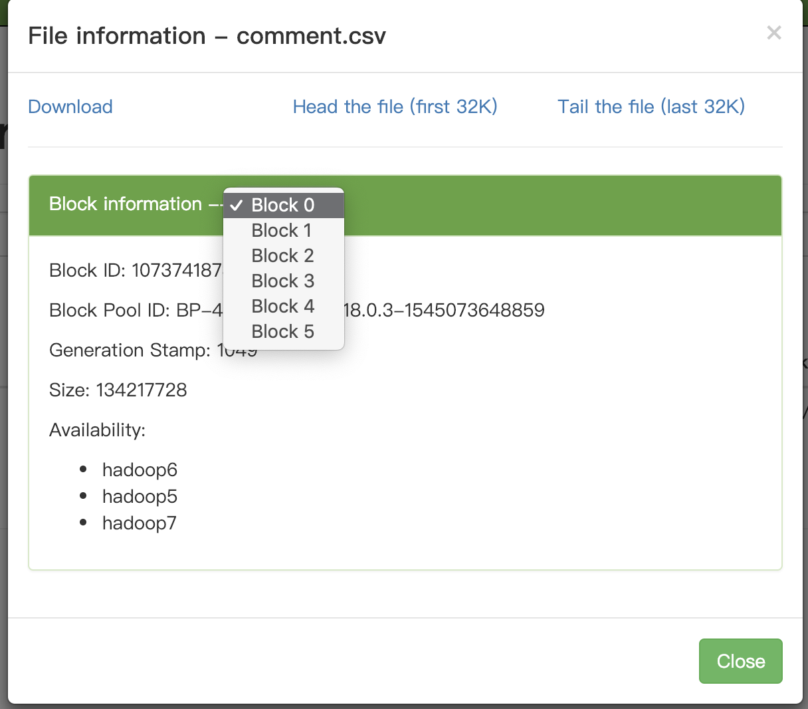
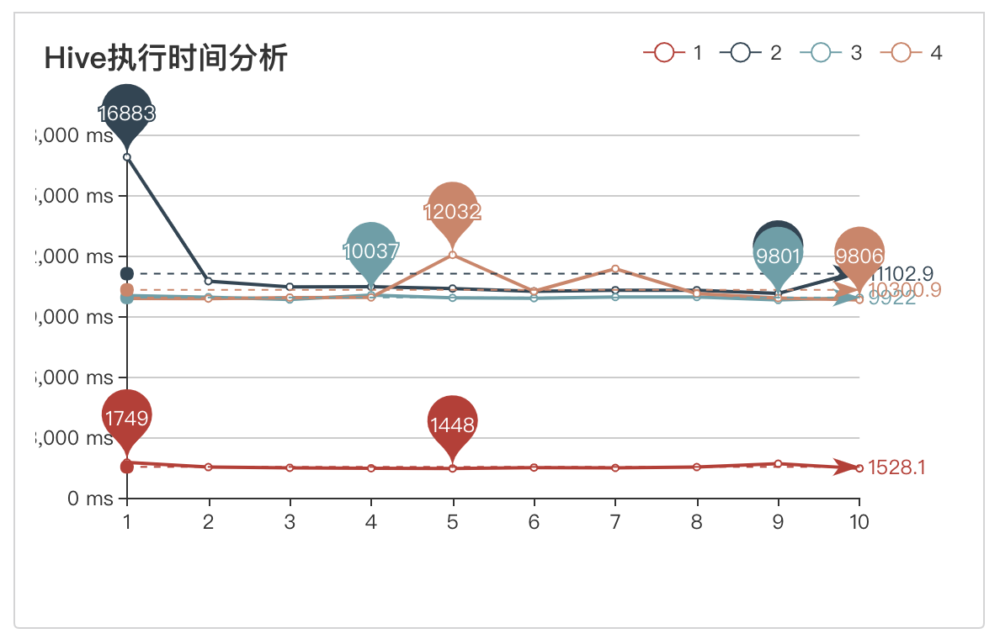
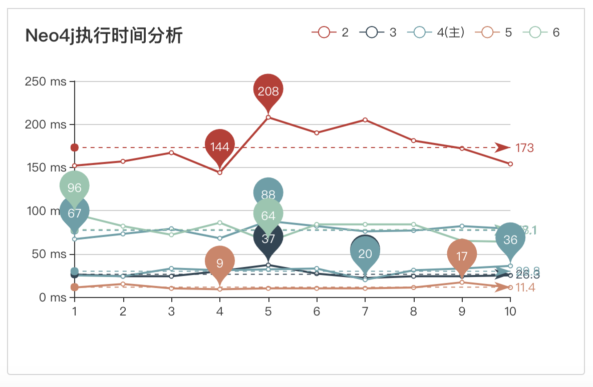

# 数据仓库项目文档

## 简介

本项目我们基于Stanford University中的Amazon Movie Comment数据，利用爬虫技术爬取了数十万的电影信息数据以及数百万计的电影评论数据，并通过搭建Neo4j图数据库、MySQL关系型数据库、Influx时序数据库及Hive分布式数据库对数据进行存储、分析及实现功能，同时对于部分功能需求针对这4种数据库进行效率对比分析。

## 系统架构

### Neo4j

- 操作系统：macOS Mojave 10.14.1

- 硬件：Core i5 & 16GB RAM

- 软件：Neo4j Desktop Version 1.1.10 (1.1.10.436)

- 选择理由：
  - 高性能：Neo4j以图的遍历算法来帮助查询数据，查询时从一个节点开始，根据其连接的关系，快速和方便地找出它的邻近节点。这种查找数据的方法并不受数据量的大小所影响，因为邻近查询始终查找的是有限的局部数据，不会对整个数据库进行搜索。所以，Neo4j具有非常高效的查询性能，相比于RDBMS可以提高数倍乃至数十倍的查询速度。而且查询速度不会因数据量的增长而下降。
  - 灵活性：图数据结构的自然伸展特性及其非结构化的数据格式让Neo4j的数据库设计可以具有很大的伸缩性和灵活性，使其可以随着需求的变化而增加的节点、关系及其属性并不会影响到原来数据的正常使用，因此在项目后期的推进中，我们也可以不断的快速修改neo4j数据库中的内容来满足我们的查询需求。
  - 直观性：图数据库使用图的形式作为数据库最主要的展现形式，可以更清楚的帮助我们理解整个数据库中数据之间的联系，Cypher语言的灵活性也帮助我们更轻松的操控数据库
- 存储模型简介：
  - 本项目中主要建立了Neo4j的两个不同的库，一个库是围绕电影的相关信息，我们在其中存储了和电影有关的所有信息，包括导演，制片人，演员，类别，语言，字幕，编剧等等，节点与节点之间通过不同的关系相连接。第二个库针对合作关系，分别存储了导演，演员，以及类别，通过节点与节点之间的关系，记录他们彼此的合作次数，类别的引入也帮助我们分析导演的执导风格。

- 存储模型：图
- 性能对比分析：
  - 数据存储：Neo4j对于图的存储自然是经过特别优化的。不像传统数据库的一条记录一条数据的存储方式，Neo4j的存储方式是：节点的类别，属性，边的类别，属性等都是分开存储的，这将大大有助于提高图形数据库的性能。在Neo4j 中属性，关系等文件是以数组作为核心存储结构；同时对节点，属性，关系等类型的每个数据项都会分配一个唯一的ID，在存储时以该ID 为数组的下标。这样，在访问时通过其ID作为下标，实现快速定位。
  - 数据读写：在Neo4j中，存储节点时，每个节点都有指向其邻居节点的指针，可以让我们在O(1)的时间内找到邻居节点。另外，按照官方的说法，在Neo4j中边是最重要的,是"first-class entities"，所以单独存储，这有利于在图遍历的时候提高速度，也可以很方便地以任何方向进行遍历。邻近查询帮助Neo4j始终查找的是有限的局部数据，不会对整个数据库进行搜索。所以，Neo4j具有非常高效的查询性能，相比于RDBMS可以提高数倍乃至数十倍的查询速度。而且查询速度不会因数据量的增长而下降。

### MySQL

- 操作系统：macOS Mojave 10.14.1 Beta

- 硬件：Intel(R) Core(TM) i5-3470 CPU @ 3.20GHz/ 4 GB 1600 MHz DDR3

- 软件：Docker 1.13.1/ MySQL 5.7

- 选择理由：

  MySQL是时下使用率最高的几款关系型数据库之一，且其体积相较其他关系型数据库更小巧且性能不输大型关系型数据库。关系型数据库是我们最常接触也是在对数据进行存储时会最先想到的数据库类型。我们想要借助关系型数据库以及行式存储对我们的数据进行存储，并通过对应的数据库操作对存储对数据进行分析/查询，实现我们对应的目的。

- 存储模型简介：

  在本项目中我们选择雪花模型作为我们关系型数据库的存储模型。雪花存储模型使用规范化的数据，数据在数据库内部是组织好的，消除冗余以减少数据量。相比之下，星型模型使用的是反规范化的数据，会在存储时存储大量的冗余数据。规范化存储数据同时也带来查询时间上的消耗，其查询更新速度会慢于星型存储模型。但是考虑到我们项目到数据单表最大12万左右，对于这个数量级到数据星型模型的查询速度相比雪花模型没有非常明显的差距，而雪花模型能够帮助我们减少了很多不必要的冗余数据的存储，所以我们选用了雪花模型。我们的数据库设计了实体表与关系表，各个实体表有自己的唯一的主键，实体表之间的联系使用关系表进行关联，减少了很多实体数据的存储，符合第三范式。

- 性能分析：

  在一开始，我们并没有对每个表建立相应的索引，在这种情况下我们单表的query速度在一个可接受的范围内，但是一旦涉及多表联合查询，如查询每个导演执导的电影数量时，需要关联三张表，在这种情况下查询速度非常的慢，因为其中涉及来表的结合与数据的聚合查询。针对联合查询过慢的速度下，我们为每张实体表以及关系表建立主码索引，并且在常用的搜索字段，如电影的上映日期上建立对应的索引，并且在这种大量数据的情况需要先对表建立索引再将数据导入，因为导入数据之后再建立索引会消耗大量的时间。索引建立之后再进行同样的多表联合查询操作，可以发现速度得到了明显的提升，在当前十万级别的数据量下查询耗时基本在五十毫秒之内。所以在MySQL中建立适当的索引能够在很大程度上提升查询的速度，同时也会牺牲一定的查询/更新效率。

  

### Influx

- 操作系统：windows10
- 硬件：Intel(R) Core(TM) i5-6300HQ CPU @2.30GHz & 8GB RAM
- 软件：influx1.7.1
- 选择理由：
  首先，查询场景中有用到对世界特性比较敏感的数据，例如，根据时间查询等，所以使用influxDB。influxDB继承了LSM Tree的顺序写入的特点，所以写入性能很好（先把大量的数据顺序写，然后持久化到磁盘。）时序数据库每次读取数据都是读取固定series的指定时间范围的连续数据，因为是顺序写入，所以这种读取比较快速。
- 存储模型简介：
  influxdb中我们主要存 电影id，电影类别，电影语言，电影观看人数，电影上映时间。其中，将电影类别与电影语言当做tag存储，电影id以及电影观看人数当做field存储，其中上映时间就是时间戳存储。
- 存储模型：
 
- 性能对比分析：
  
  InfluxDB用于存储大量的时间序列数据，并对这些数据进行快速的实时分析。SQL数据库也可以提供时序的功能，但时序并不是其目的。
  在InfluxDB中，timestamp标识了在任何给定数据series中的单个点。就像关系型数据库中的主键。
  InfluxDB考虑到schema可能随时间而改变，因此赋予了其便利的动态能力。但是由于在项目中，时间相关的数据较为固定，因此其性能的体现并不是特别好。

### Hive

- 操作系统：macOS Mojave 10.14.1

- 硬件：Core i7 & 16GB RAM

- 软件：Hive 3.1.1 & Hadoop 3.1.1 & MySQL 5.7

- 选择理由：

  Hive首先有很多以上数据库所不具有的优点，如扩展性和容错性，本项目我们选择hive来处理一部分数据主要是作为MySQL数据库的对照。针对我们项目的百万级的数据量来对比分析关系型数据库和分布式数据库在数据量较大时的性能优劣性，以此窥见数据仓库对比于数据库的所展现出来的优点。同时对于项目中的部分功能需求组合采用hive与其他数据库分治的方式，来实现复杂的功能需求，以此来学习工程中数据仓库与普通数据库结合的实现方法。而由于数据量及需求的限制，我们只可窥见数据仓库其作用的冰山一角，希望藉此加深我们对数据仓库的理解。

- 存储模型简介：
  
  在hive中我们存储的数据与MySQL中一样。因此建立了与MySQL完全相同的存储结构。另外针对hive本身自带的不同的存储模型，我们还创建了textfile和ORCfile两种表存储结构。

- 分布式架构：
  
  

- 性能对比分析：

  从我们对于MySQL和Hive这两种比较有可比性的数据库之间的对比来说，MySQL的执行时间基本上是远远快于Hive的执行时间的。
  首先，考虑我们在这两种数据库中执行的操作，如果对于一开始数据从文件进入数据库中这一过程忽略的话，我们整个项目执行的都是OLAP即联机分析处理操作。Hive作为一个经典的数据仓库工具，本身应该是擅长执行OLAP操作的，因此暂且认为"操作"不是造成二者执行时间差异的原因；
  其次，Hive官网有句话"Hive在大型数据集上会表现出优越的性能"，考虑到我们的项目数据集中，最多的数据集是700多万条的用户评论数据，而基本功能的实现都是操作在数据量仅有10万余条的电影数据，我们猜测是数据量限制了Hive体现其优越性。因此我们作了如下实验：在等量的数据量变化上，我们比较二者变化前后的执行的时间，得到下表：
  | 数据库类型| 10W数据 | 700W数据 |
  |----------------| -----:| :----: |
  | MySQL   |   9ms   |   271ms   |
  | Hive(textfile)    |   1428ms    |   5100ms    |
  就时间来说，很显然MySQL更胜一筹，但从增长比例来说，MySQL从9ms增长至271ms增长约为30倍，而Hive增长约为5倍，由此我们可窥见Hive在大量数据集时性能会更加优越。然而在这过程中，我们所使用的Hive所采用的为textfile存储结构，意即内容即文件，表数据完全按照表结构存储成为文本文件，我们创建了t_comment表存储用户评论信息，表数据文件如下：
  
  
  从Hive官方文档我们得知Hive有其他更加优越的存储格式，它包含SequenceFile、RCFile、ORCFile，我们采取了所谓最优的ORCFile来Duplicate了用户评论表，想以此对比ORCFile之于TextFile的优点，我们创建了t_comment_orc表，并从t_comment中把数据原封不动的导入进来，可见表数据文件如下：
  
  不难看到ORC表文件(260MB)明显比TextFile表文件(705MB)小多了，至于性能，同样对于上述实验，我们添加了ORC表的结果：
  | 数据库类型| 10W数据 | 760W数据 |
  |----------------| -----:| :----: |
  | MySQL   |   9ms   |   134ms   |
  | Hive(textfile)    |   1428ms    |   5100ms    |
  | Hive(ORC)    |   110ms    |   126ms    |
  结果显而易见，当数据达到数百万量级时，Hive**较优**的使用方法下已经要比MySQL要稍显胜势了。
  通过以上两点以及常识我们不难看出：

  - 限制Hive的效率的因素：

    - 数据量

    - 计算框架

      Hive在我们项目中使用的是MapReduce框架来执行分布式计算，然而比现在已经有很多比MapReduce快得多的计算框架例如Spark等，因此若使用这些框架必定会使

    - 网络通信

      由于我们的集群搭建在Docker容器中，其间数据通过程序写定的程序通道传输而非真实的网络通信，因此暂且看不出网络对执行的影响，而真实场景中，这必是一项重要的考虑因素

  - 百万级数据的OLAP场景或者OLTP操作需求较多的场景下，MySQL(关系型数据库)是优选
  - 千万乃至亿万级数据的批处理、分析场景，Hive(数据仓库/分布式数据库)在存储、读取、分析效率上都要更优

  其三，上述操作均是在单表查询的前提下，但是在多表查询情况下Hive的效率如何呢？先看测试结果，我们仅在"导演-执导-电影"三表上做了多表查询，执行"某导演执导电影的数量"的操作，执行时间记录如下：

  | 数据库类型| 时间 |
  |------| -----:|
  | MySQL   |   28ms   |
  | Hive    |   9922ms    |

  此现象引出了数据仓库在实际应用中的一种常见处理方式：为了提高速度而产生数据冗余。Hive中的表是很特殊的，其没有主键、外键同时库中各个表之间的冗余会很明显，这使得管理人员方便针对各种功能设计所需的信息表，这也是数据仓库作为大量数据集的OLAP最佳选择的原因之一。
  
## 性能对比

- 走势变化：

  由图可见，四种数据库中执行时间都是先较多然后减少最后趋于稳定，我们对其分析可能是jdbc在首次连接时需要较多时间进行网络通信，当一次连接建立后，我们并没有关闭该连接，在此基础上程序执行后续的事务才应当是其真实的操作时间。

- 功能对比：

  不同的数据库，在不同的功能需求下各有优劣。举个例子，在查询实体间的关系时，对于完全符合3NF的关系型数据库来说，可能需要多表连接查询，这明显会消耗大量时间，而对于基于relation的数据库例如Neo4j来说，类似查询正是其强项。

## 总结

- 本项目使用了JavaWeb框架，并基于sementicUI进行前端开发。
- 在数据库选择上，我们使用了Mysql，hive，Neo4j以及influxDB四个不同的数据库进行横向纵向比对，通过实现一定的基本功能搜索以及多表联查，统计他们的性能，查询时间等数据并进行相应的分析，对于不同数据库的优劣势有了更为清晰的了解。
- 在项目过程中，我们将上课学到的知识应用到实践中，尝试了雪花，星型等不同的存储结构，并根据自己的项目实情选择了最适合我们的项目存储结构。针对不同的实验现象，我们也通过网络等资源来进行辅助学习，帮助我们更好的了解不同数据库以及其不同的存储，读取等方式。
- 项目过程中，特别感谢老师和助教们的帮助，让我们更为深入了解了数据仓库技术，为我们今后的项目实践打下了扎实的基础。

